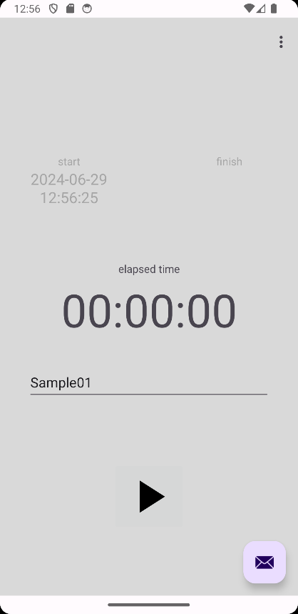

# elapsed_time_counter

経過時間カウンター。Google Play Console Developerアカウントを作ったものの、何年も何もせず放置していたらアカウントがBanされそうになったので、あわてて作った時間カウントアプリ。

## 機能

経過時間をカウントするストップウォッチ的なもの。カウントした結果は GMail の本文へ転記できるので、GMail 経由で Microsoft Excel や Google Spreadsheet にコピペできる。

## 改善したい点

あわてて作ったアプリなので非常に作りが粗い。以下の点は改善したい。

- 2024-11-12 時点で認識している問題点。
  - [x] onDestroyの対応が甘く、他アプリの裏に回ると元の状態に復帰できず、カウントした時間が消えてしまう。 → 2024-07-24に解決した。
  - [ ] ~~ViewHistoryで表示できる内容を選択・コピペできない。~~ → 2024-10-19に改めて見直すと、この機能は別に要らない気がするので削除する。
  - [x] TaskTitleを履歴から選択できない（そうしたつもりだったけど選択できない。） → 2024-10-19に解決した。5件の履歴を表示するようにした。
  - [ ] GMail本文にタブ文字を書き込めない（ExcelやSpreadSheetにコピペする元ネタとしてタブ区切りテキストを書き込むつもりだったが、それができない。）
  - [x] メイン画面を縦スクロールできず、マルチウィンドウ表示時に開始・停止ボタンを押下できない → 2024-11-12に解決した。正しい方法なのかはわからない。

## 参考資料

こんなアプリでも作るのは大変だった。試行錯誤を記録してくれた先人たちに感謝しています。

### Activityについて

convert to constraint layout を選ばないと自由にオブジェクトを配置できない。

- -, アクティビティ, Android Developers, 2024-05-23, <https://developer.android.com/guide/topics/manifest/activity-element?hl=ja>
- @hitting1024, Androidで表示しているActivity名を取得する, Qiita, 2015-06-11, <https://qiita.com/hitting1024/items/a63b39cace7e0534c77a>

### Fragmentについて

- -, フラグメント マネージャー, Android Developers, 2024-02-16, <https://developer.android.com/guide/fragments/fragmentmanager?hl=ja>
- たーぼー, 【Androidアプリ開発】FragmentからActivityのメソッドを実行する、一番簡単な方法, ノマド放浪記, 2017-03-02, <https://calculus-app.com/blog/develop_android/android_fragment/167>
- @Reyurnible (shun hosaka), Android はじめてのFragment イベント編, Qiita, 2016-05-18, <https://qiita.com/Reyurnible/items/d6397f5fbb03ee4fb93b>
- @tkmd35 (まっち), 【Android / Java】表示Fragmentによりイベントを切り替える, Qiita, 2020-10-29, <https://qiita.com/tkmd35/items/d18b0adfab3f5f2e3863>
- -, FragmentManager を使用する, Android Developers, 2024-02-16, <https://developer.android.com/guide/fragments/fragmentmanager?hl=ja#using>

### bindingで文字変更 フラグメント

- -, 【findViewByIdを使わない方法ViewBinding】初心者に歴史の流れと共にわかりやすく解説, AndroidBlog.東京, 2022-11-11, <https://androidblog.tokyo/viewbinding-instedof-findviewbyid/>
- -, FragmentでのView Binding(ビューバインディング)の使い方をまとめてみた【Android】【Kotlin】, 初心者から独学でアプリ開発を始めてみた, 2021-06-05, <https://sakumin63.com/70.html>
- @rei-m (Rei Matsushita), KotlinでAndroid Data Bindingを使ってみた, Qiita, 2016-02-19, <https://qiita.com/rei-m/items/1ad5bbab92717252bbb2>

### FragmentからActivityの関数を呼び出したりその逆をしたり

- s.w, 【Android】Fragmentを使う② - ActivityとFragmentの相互呼び出し -, バーティのIT技術ブログ, 2018-09-01, <https://www.s-watanabe.work/2018/09/fragment-activityfragment.html>
- tsntsumi, findFragmentById が必ず null を返す, tsntsumi’s NOOTO, 2014-04-23, <https://tsntsumi.hatenadiary.org/entry/20140423/findFragmentById_always_returns_null>
- tera877, androidstudioでNullPointerExceptionというRuntimeExceptionが投げられました, teratail, 2023-05-13, <https://teratail.com/questions/u2exlouqewyvpn>

`android.view.ViewRootImpl$CalledFromWrongThreadException: Only the original thread that created a view hierarchy can touch its views. Expected: main Calling: Timer-1` というエラーが発生した…。

- 株式会社シーポイントラボ, 【Android】「Only the original thread that created a view hierarchy can touch its views.」の対処法, 株式会社シーポイントラボ, -, <https://cpoint-lab.co.jp/article/201810/5903/>
- @PoodleMaster (PoodleMaster), 【Android】Handlerによる周期処理 in Kotlin, Qiita, 2021-09-10, <https://qiita.com/PoodleMaster/items/69e96da401ed040f0603>

### ファイル読み書き

- @LHS, AndroidStudio　Kotlin　で ファイルの読み込み, Qiita, 2023-06-07, <https://qiita.com/LHS/questions/affb60a0b9eb9836c3de>
- @nimani, kotlinでテキストファイルの読み込み、書き出し, Qiita, 2019-07-24, <https://qiita.com/nimani/items/2762b0c949a1ce0daa4a>
- えむてぃ, Android10以降で共有ストレージに保存されたファイルの読み書きを実装したい（Kotlin）, 何かをやりたい何かになりたい, 2022-09-19, <https://trueman-developer.blogspot.com/2022/09/android10kotlin.html>
- -, Kotlinにファイルが存在するかどうかを確認します, Techie Delight コーディング面接で合格する, 2022-01-07, <https://www.techiedelight.com/ja/check-if-a-file-exists-in-kotlin/>
- -, テキストファイルからの読み込み, あんずのしっぽ Apricot Tail, 2023-10-01, <https://apricottail.com/?P=kotlin_7>

### Gmailへのインテント

- @uchida001tmhr (ともちゃん), 自作アプリで、Intentを使用してGmailアプリに、CC, BCC, 件名, 本文が渡せない。, Qiita, 2020-01-25, <https://qiita.com/uchida001tmhr/items/8244f712239f89996731>
- @masaibar, いつの間にかメーラーを起動するIntentの推奨形式が変わっていて件名や本文が入力されなくなっていたので対応した, Qiita, 2020-03-06, <https://qiita.com/masaibar/items/4edcc9c7d2df11fe6e79>
- やす, 【Android】Android 11 以降で Intent を使ってメールアプリを起動する, Zenn, 2023-11-12, <https://zenn.dev/yass97/articles/1ce943fb39a491>
- -, 他のアプリと連携する, Android Developers, 2024-02-15, <https://developer.android.com/training/basics/intents?hl=ja&_gl=1*xs37uk*_up*MQ..*_ga*Mjk2NjcyNjc3LjE3MTk1NTEyMzg.*_ga_6HH9YJMN9M*MTcxOTU1MTIzNy4xLjAuMTcxOTU1MTIzNy4wLjAuMA..>

### タイトルバーのカスタマイズ

- yanzm, Android　タイトルバーをカスタマイズ, Y.A.M の雑記帳, 2010-05-03, <https://y-anz-m.blogspot.com/2010/05/android.html>

### print関数（Log.d）

- taka, Logcatで表示されるログとされないログがある。（フィルタではないです。）, Google Group, 2012-04-03, <https://groups.google.com/g/android-group-japan/c/Sb4fHDp6R_w?pli=1>

### "Waiting for target device to come online"

"Waiting for target device to come online" と表示されるようになった。Device ManagerからCold Bootを選択してみた。

- @alcueid, Android Studioでアプリの実行待ち状態のまま進まないときの対処方法, 積水成淵日記, 2018-07-29, <https://sekisuiseien.com/computer/11583/>
- b0npu, Androidエミュレータの再起動で解決しないエラーがCold Bootで解決した, あかんわ, 2018-04-07, <https://b0npu.hatenablog.com/entry/2018/04/07/084709>

### EditTextの改行を禁止にしたい

EditTextのinputTypeを明示的に設定する

- mucchin, EditTextで改行を不可にする方法, mucchinのAndroid戦記, -, <https://android.roof-balcony.com/view/edittext/multiline/#google_vignette>

### テキストボックス（autocompletetextview）のフォーカスを外したい

背景タップ時。にフォーカスを外したい。一工夫必要。イベントをキャッチする必要あり。

- 株式会社シーポイントラボ, 【Android】背景をタップした際にEditTextのフォーカスを外す, 株式会社シーポイントラボ, 2022-02-09, <https://cpoint-lab.co.jp/article/202202/22053/>
- -, InputMethodManager, Android Developers, 2024-06-18, <https://developer.android.com/reference/android/view/inputmethod/InputMethodManager>
- @tkmd35 (まっち), 【Android / Kotlin】フォーム（EditText）入力の際、背景タップで表示キーボードを閉じる, Qiita, 2021-01-01, <https://qiita.com/tkmd35/items/7d2bd568bd646d0ce6a9>
- ponkichi, Android｜EditTextのキーボード非表示 ＆ focus管理, Zenn, 2022-07-29, Android｜EditTextのキーボード非表示 ＆ focus管理, <https://zenn.dev/ponkichi/articles/0c069d05071683>
- @kzkapr1129, EditTextでエンターキーが押されたらSWキーボードを閉じる, Qiita, 2022-12-09, <https://qiita.com/kzkapr1129/items/799e593106e73381cf03>
- -, AutoCompleteTextView クラス, Microsoft Learn, -, <https://learn.microsoft.com/ja-jp/dotnet/api/android.widget.autocompletetextview?view=xamarin-android-sdk-13>

### タイマー

デフォルト設定だと "Call requires API level 26 (current min is 24): java.time.LocalDateTime#now" というエラーが発生するので、最低 API レベルを 26 に上げる必要があった。

- Japanシーモア, Kotlinで完璧にタイマー処理を実装するための17選, JPSM, -, <https://jp-seemore.com/app/14799/>
  - ○LocalDateTimeを使った現在日時の取得, <https://jp-seemore.com/app/14982/#toc5>
- @orimomo, 【Kotlin】LocalDateで2つの日付を比較し、日数の差分を取得する, Qiita, 2019-07-28, <https://qiita.com/orimomo/items/c15fff517701a56b0cd9>

### toast

toastはドロイド君のアイコンが表示されるようになったようだ。思ってたのと違う感じの表示で、あんまり使いたくない。

- [Android] Toast を表示させる, nyanのアプリ開発, 2022-06-01, <https://akira-watson.com/android/toast.html>

### ダイアログ

- たくろーどん, Android：DialogFragmentからDialogFragmentを呼び出す方法, Zenn, 2022-10-06, <https://zenn.dev/takudooon/articles/106cdd21f12b4f>
- suihan74, ダイアログからダイアログを開く, すいはんぶろぐ.io, 2020-12-20, <https://suihan74.github.io/posts/2020/12_01_00_show_dialog_from_dialog/>

### 実機でデバッグ

- Noah, 【Android Studio】自分のスマホ ( 実機 ) で動かす – USB編, ドロイドくんとわたし。, 2022-10-31, <https://yowayowa-engineer.com/run-device-usb/>

### アプリアイコンを変更する

- -, 5. アプリアイコンを変更する, developer.android.com, -, <https://developer.android.com/codelabs/basic-android-kotlin-compose-training-change-app-icon?hl=ja#0>
- -, SVG のツール, mdn web docs_, -, <https://developer.mozilla.org/ja/docs/Web/SVG/Tutorial/Tools_for_SVG>
- -, Google Drawings - easily create diagrams and charts., -, -, <https://docs.google.com/drawings>
  - 2.83cm x 2.83cm
  - 「メニュー - ページ設定」でキャンバスサイズを変更できる。

### リリースビルド

- @Diavolo, [Android]リリースビルドを実行して、スマホにインストールする方法, Qiita, 2021-11-03, <https://qiita.com/Diavolo/items/c80193e0374f882922e5>
<https://qiita.com/LicaOka/items/3f5586bfb6a90649168b>

新 UI の Androiod Studio ではハンバーガーメニューを触るとメニューが出てくる。[Build] - [Generate Signed App Bundle /App ...] を選択する。
出力先はここ→ `elapsed_time_counter\app\release\app-release.aab`

### バージョンコード

- it-chan, Androidアプリのバージョンコードはこうつける – Androidアプリ開発（10）, ITミュージアム, 2023-08-01, <https://koyari.jp/it/version-code-name/1115/>

`app\build.gradle.kts` の `defaultConfig.versionCode = 1" の数値を上げ、`defaultConfig.versionName = "1.0.0"` を任意のバージョンにすればよい。
File - Project Structure からも変更可能。

### Android Studioのrunボタンが押せない

- @hydrangernight, AndroidStudioで実行ボタンが押せない時の対処とそのしくみ, Qiita, 2023-09-19, <https://qiita.com/hydrangernight/items/45dea3d85c75109cc0c9>

> AndroidStudioのメニューの「File」→「Sync Project with Gradle Files」をクリックし、処理が終わると押せるように。

### プライバシーポリシー

- チンプー@GAFAMエンジニア, App Privacy Policy Generatorでアプリのプライバシーポリシーを30秒生成！, Note, 2023-06-11, <https://note.com/danchi_kun/n/n216824317df6>
- Nishant, App Privacy Policy Generator, app-privacy-policy-generator.firebaseapp.com, -, <https://app-privacy-policy-generator.firebaseapp.com/>

[App Privacy Policy Generator](https://app-privacy-policy-generator.firebaseapp.com/) が神ツール。

### githab pages

- @snow_swallow, Github Pagesの使い方まとめ, Qiita, 2023-05-20, <https://qiita.com/snow_swallow/items/631bbceabbb953da2646>

### githubのルール

- jhcoder,【github】mainブランチに対して直接pushを禁止する保護ルールを設定をする, Zenn, 2023-12-21, <https://zenn.dev/json_hardcoder/articles/f9b534377103a4>

### ドキュメンテーションコメント

- -, Document Kotlin code: KDoc, Kotlin docs v2.0.0, -, <https://kotlinlang.org/docs/kotlin-doc.html#kdoc-syntax>
- @opengl-8080, KDoc 書き方メモ(Kotlin のドキュメンテーションコメント), Qiita, 2018-01-07, <https://qiita.com/opengl-8080/items/fe43adef48e6162e6166>

### ActivityのonDestroyからの復帰

- @teradonburi, Androidのライフサイクルからアプリ設計を見直してみる, Qiita, 2017-02-26, <https://qiita.com/teradonburi/items/f2aac85e53f8fa5c79bc>
- @shira-jun, onSaveInstanceState()と回転問題, Qiita, 2019-06-08, <https://qiita.com/shira-jun/items/dd57eb6eccc516982fd7>
- 緒方聡, 知らずに作って大丈夫？Androidの基本的なライフサイクルイベント31選, @IT, 2016-04-04, <https://atmarkit.itmedia.co.jp/ait/articles/1604/04/news011_3.html>
- @wbspry (Y), 【Android】savedInstanceStateの意味と開発者オプション【初心者向け】, Qiita, 2017-03-21, <https://qiita.com/wbspry/items/c6e342a9008bebef75bd>
- usuiat, Jetpack Compose入門(15) 画面遷移, 縁側プログラミング, 2022-01-16, <https://engawapg.net/jetpack-compose/1393/screen-transition/>
- SanGong, Fragmentを使ってみる（その５）ActivityからFragmentを操作, SanGongブログ, 2022-10-13, <https://sangong-blog.org/?p=500>
- fineblue206, [Android]Bundleに独自クラスを格納する方法（Parcelableインターフェイス）, fineblue206.net My IT memorandum, 2018-06-28, <https://fineblue206.net/archives/271>
- -, Bundle, Android Developers, -, <https://developer.android.com/reference/android/os/Bundle#summary>
- Ararami Studio, AndroidのActivityは再作成に備えてSavedInstanceStateを使おう, Ararami Studio, 2018-01-18, <https://araramistudio.jimdo.com/2018/01/18/androidのactivityは再作成に備えてsavedinstancestateを使おう/>
- @kaiinui, Android の罠 [1] ちゃんと onSaveInstanceState する, Qiita, 2014-08-19, <https://qiita.com/kaiinui/items/8a6a7dddb9310f645da3>

Activityがdestroyした後に復帰させた場合、firstfragmentを再描画することになる。
幸いなことに時刻さえ保存できていれば再描画するだけでどうにかなるはず。

動きを確認する場合、［開発者ツール］ - ［アプリ］ - ［アクティビティを保持しない］を有効化するとよい。
この設定を有効化すると、アプリが裏に回っただけでアクティビティが破棄されるようになる。

### AutoCompleteTextView

- yanzm, Android　AutoCompleteTextView で候補に入力履歴を表示する, Y.A.M の 雑記帳, 2013-02/14, <https://y-anz-m.blogspot.com/2013/02/androidautocompletetextview.html>
- Unknown, ドロップダウンの表示(AutoCompleteTextView), Androidアプリ開発！！, 2013-03-12, <https://androidgamepark.blogspot.com/2013/03/autocompletetextview.html>
- @wa2c (wa2c), AndroidのAutoCompleteTextViewで、常に全ての候補を一覧に表示する, Qiita, 2018-09-18, <https://qiita.com/wa2c/items/2bf9172543ca29af76bc>
- -, AutoCompleteTextView, Android Developers, 2024-07-18<https://developer.android.com/reference/android/widget/AutoCompleteTextView>
- Yusuke, Android の AutoCompleteTextView で文字と背景が白くなってしまう, 穀風, 2013-08-14, <https://kokufu.blogspot.com/2013/08/android-autocompletetextview.html>
- BG1, AutoCompleteTextView.showDropDown, 車輪のx発明 ~B.G's Blog~, 2018-10-16, <https://bg1.hatenablog.com/entry/2018/10/06/210000>
- @Horie1024, AutoCompleteTextViewでハッシュタグの補完を実装してみる, Qiita, 2016-02-01, <https://qiita.com/Horie1024/items/545659072250ca0b24ed>

### DB 操作 (Room)

SQLite を直接操作するのではなく、 Room という抽象レイヤー操作機構を利用するのが今のトレンドらしい。

- -, Room を使用してローカル データベースにデータを保存する, Android Developers, 2024-08-22, <https://developer.android.com/training/data-storage/room?hl=ja>
- <https://note.com/haine_rion23/n/nd61ae9ee4bbd>
- <https://developer.android.com/build/migrate-to-ksp?hl=ja>
- <https://qiita.com/sdkei/items/6acf34f081ddde59ce11
- <https://torikatsu923.hatenablog.com/entry/2019/11/14/154251>
- <https://developer.android.com/codelabs/basic-android-kotlin-compose-persisting-data-room?hl=ja#0>
- <https://qiita.com/yamauchihrt/items/bbe11274150cc41573c1>
- <https://pg.akihiro-takeda.com/android-room-error/>
- <https://tech-fill.net/android-room-sample/#DatabaseSingleton>
- <https://qiita.com/iTakahiro/items/e39533b7fc07573a14da>
- <https://github.com/kotlin/kotlinx.coroutines/blob/master/README.md>

- kotlin のバージョンを調べる方法：
  - <https://www.reddit.com/r/AndroidStudio/comments/1dgagab/how_to_check_kotlin_version/>
    - File - Settings - Other Settings - Kotlin Compiler ... Kotlin Compiler Version / Language Version / API Version
      - 現在使っているのは v1.9.0 のようだ。
      - そうなると、対応する KSP のバージョンはこれかな <https://github.com/google/ksp/releases/tag/1.9.0-1.0.13>
- kapt はメンテナンスモードに入っているので、使わないことにしよう。 <https://kotlinlang.org/docs/kapt.html>
  - `build.gradle.kts` と `app/build.gradle.kts` に Room を使うための参照と KSP を使うための参照を追記した。 

- 以下の手順でデータベースの中身を表示できる。
  - Android Studio で、メニューバーから [View] > [Tool Windows] > [App Inspection] を選択します。
  - [Database Inspector] タブを選択します。

<https://support.google.com/googleplay/android-developer/answer/9844679?hl=ja>
